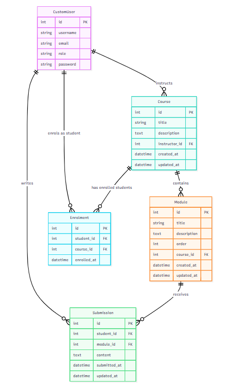

# E-Learning Platform API

This is a Django REST Framework based backend API for an e-learning platform. It allows users to register as different roles (Student, Instructor, Admin) and manages courses, modules, enrolments, and submissions.

## Project Structure

The project is divided into several Django apps:
- **`accounts`**: Manages custom user authentication and roles (Student, Instructor, Admin).
- **`courses`**: Manages courses and their modules. Instructors can create courses and modules.
- **`enrolments`**: Handles student enrolments into courses.
- **`submissions`**: Manages student submissions for specific course modules.

## Entity-Relationship Diagram (ERD)

Below is the Entity-Relationship Diagram detailing the database schema:



## How to Run the Project on a Local System

Follow these steps to set up and run the API on your local machine.

### Prerequisites
- Python (3.8 or higher recommended)
- `pip` (Python package manager)

### Setup Instructions

1. **Clone or Download the Repository:**
   Ensure you have the project files on your local machine. Navigate to the project root directory (`omka_assessment`) in your terminal.

2. **Create a Virtual Environment:**
   It's a best practice to use a virtual environment to manage dependencies.
   ```bash
   # On Windows
   python -m venv venv
   
   # On macOS/Linux
   python3 -m venv venv
   ```

3. **Activate the Virtual Environment:**
   ```bash
   # On Windows
   .\venv\Scripts\activate
   
   # On macOS/Linux
   source venv/bin/activate
   ```

4. **Install Dependencies:**
   Install the required Python packages from the `requirements.txt` file.
   ```bash
   pip install -r requirements.txt
   ```

5. **Apply Database Migrations:**
   Initialize the database with the required tables (Django uses SQLite by default).
   ```bash
   python manage.py migrate
   ```

6. **Create a Superuser (Optional but Recommended):**
   Create an admin user to access the Django admin panel and manage the platform.
   ```bash
   python manage.py createsuperuser
   ```

7. **Run the Development Server:**
   Start the local server.
   ```bash
   python manage.py runserver
   ```

8. **Access the Application:**
   Open your web browser or an API testing tool (like Postman or cURL) and navigate to:
   - Base URL: `http://127.0.0.1:8000/`
   - Admin Panel: `http://127.0.0.1:8000/admin/`

## Testing the APIs

A test script `test_apis.py` is included in the project root to demonstrate the API endpoints. You can run it (while the local server is running) to verify the functionality:

```bash
python test_apis.py
```
